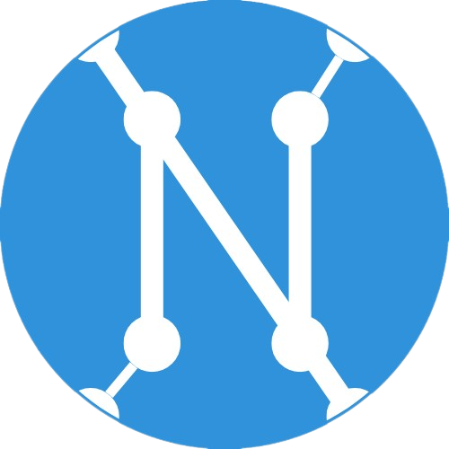

# Terraform Infrastructure as Code for Neferdata



## Table of Contents

- [Introduction](#introduction)
- [Prerequisites](#prerequisites)
- [Getting Started](#getting-started)
- [Terraform Variables](#terraform-variables)
- [Usage](#usage)
- [Resources](#resources)
- [License](#license)

## Introduction

This Terraform project is designed to provision and manage the infrastructure for Neferdata. It includes resources for Amazon Web Services (AWS) Elastic Kubernetes Service (EKS), Amazon RDS (Relational Database Service), Amazon ElastiCache, and more. Using Infrastructure as Code (IAC) principles, you can deploy and maintain your Neferdata infrastructure with ease.

## Prerequisites

Before using this Terraform project, ensure you have the following prerequisites in place:

- [Terraform](https://www.terraform.io/downloads.html) installed on your local machine.
- AWS credentials configured with appropriate permissions. You can set these up using the AWS CLI.
- AWS CLI installed for convenient credential management.

## Getting Started

Follow these steps to get started with provisioning the Neferdata infrastructure using Terraform:

1. Clone this repository to your local machine:

git clone https://github.com/your-username/neferdata-terraform.git

2. Change into the project directory:

cd neferdata-terraform

3. Customize the Terraform variables:

Open the `terraform.tfvars` file and adjust the values to match your specific requirements. Make sure to set the `db_username` and `db_password`.

## Terraform Variables

This project utilizes Terraform variables to configure the deployment. Key variables include:

- `create_rds_instance` (bool): Flag to determine if the RDS instance should be created. Default is `false`.
- `create_redis_cluster` (bool): Flag to determine if the Redis cluster should be created. Default is `false`.
- `create_eks_cluster` (bool): Flag to determine if the EKS cluster should be created. Default is `false`.
- `region` (string): AWS region where the infrastructure should be deployed. Default is `us-east-2`.
- `db_username` (string): The database username.
- `db_password` (string, sensitive): The database password.
- `k8s_namespace` (string): The Kubernetes namespace for the service account. Default is `default`.

## Usage

1. Initialize the Terraform project:

```
terraform init
```
2. Deploy the infrastructure:
```
terraform apply
```
3. Review and confirm the changes when prompted.

## Resources

### AWS Resources

- **Amazon VPC**: The Virtual Private Cloud (VPC) for the Neferdata infrastructure.
- **Amazon EKS Cluster**: Elastic Kubernetes Service (EKS) cluster for containerized applications.
- **Amazon RDS Database**: Relational Database Service (RDS) instance for database operations.
- **Amazon ElastiCache Redis**: Redis cluster for caching data.

### IAM Roles and Policies

- **IRSA for EBS CSI**: IAM roles and policies for EBS CSI (Container Storage Interface) integration.
- **External DNS IAM Roles**: IAM roles and policies for ExternalDNS to manage Route 53 records.

### Security Groups

- **Amazon RDS Security Group**: Security group for the RDS instance to control inbound traffic.
- **ElastiCache Security Group**: Security group for ElastiCache Redis to allow inbound traffic.

### Subnet Groups

- **Amazon RDS Subnet Group**: Subnet group for RDS to determine availability zones.
- **ElastiCache Subnet Group**: Subnet group for ElastiCache Redis.

### Add-Ons

- **EBS CSI Driver for EKS**: EBS CSI driver add-on for EKS.

## License

This Terraform project is released under the Mozilla Public License 2.0. Refer to the [LICENSE](LICENSE) file for more details.

---

**Copyright (c) Neferdata, Corp**
